# RoshanRAG

[](https://github.com/sami-rk/RoshanRAG/actions/workflows/ci.yml)

**A RAG-based Document Q&A system.** Upload your text documents (DOCX/PDF/TXT), ask questions in natural language, and get accurate answers grounded in your documents, with cited sources. Built with Django, LangChain, and ChromaDB, powered by free OpenRouter LLMs with automatic fallback — fully containerized with Docker.

## Features

- Document CRUD (`docx` + `pdf` + `txt`), full-text storage
- Automatic text extraction → chunking → vector indexing
- RAG question answering with citation of used documents (MMR retrieval for diverse chunks)
- Full Q&A history (question, answer, status, sources)
- Free OpenRouter LLMs with an automatic fallback chain + readable error messages
- Admin retry actions (re-index / re-answer) and automatic stuck-task recovery
- API rate limiting and a health-check endpoint for Docker healthchecks
- Multilingual embedding model `BAAI/bge-m3` (Persian + English), GPU-aware
- Django Admin UI (Persian) + token-authenticated REST API with OpenAPI schema
- Public Persian landing page (dark/light) with home, about, pricing, contact and a styled 404, including a **chat page** (`/chat/`) for asking questions right from the browser, scroll reveals, tilt/spotlight cards, magnetic CTAs and a tech-stack marquee
- Uploaded files are protected — `/media/` requires an authenticated session or an API token
- Docker Compose with optional GPU override

## Architecture

```
┌──────────────────────────────────────────────────────────┐
│  web (Django + DRF + gunicorn)                           │
│   ┌──────────────┐   ┌───────────────────────────────┐   │
│   │ Django Admin │   │ REST API (Token auth)         │   │
│   └──────┬───────┘   └──────┬────────────────────────┘   │
│          │                  │                            │
│   ┌──────▼──────────────────▼────────────────────────┐   │
│   │  Background (threads + status fields)            │   │
│   │  extract → chunk → embed → Chroma                │   │
│   │  retrieve → LLM (OpenRouter + fallback)          │   │
│   └──────┬────────────────────────────┬──────────────┘   │
│          │                           │                   │
└──────────┼───────────────────────────┼───────────────────┘
           │                           │
   ┌───────▼─────────┐         ┌───────▼──────────┐
   │  SQLite (volume) │         │  ChromaDB container │
   └─────────────────┘         └──────────────────┘
```

RAG flow: `user question → embed → MMR retrieval (top-4 of 20, diverse) → dedupe (max 3 docs) → prompt (answer in the question's language, cite sources) → LLM → save answer + sources`.

Stuck-task safety: background tasks run in threads, so a killed worker can leave an item in `pending`/`generating`. `recover_stuck_tasks` (run automatically on container start) marks such items `failed` after 30 minutes, and the admin offers **re-index** / **re-answer** actions to retry them.

## Getting Started

### Prerequisites

1. Docker + Docker Compose
2. An API key from [openrouter.ai](https://openrouter.ai) (free models are used)
3. Optional, for GPU: [nvidia-container-toolkit](https://docs.nvidia.com/datacenter/cloud-native/container-toolkit/latest/install-guide.html)

### Run

```bash
cp .env.example .env          # then set OPENROUTER_API_KEY in .env
docker compose up --build     # CPU mode

# GPU mode (requires nvidia-container-toolkit):
docker compose -f compose.yaml -f compose.gpu.yaml up --build

# Load the bundled sample documents:
docker compose exec web python manage.py load_sample_data
```

Then:

- Landing page: <http://localhost:8000/>
- Ask-your-documents chat UI: <http://localhost:8000/chat/> (login required)
- Admin: <http://localhost:8000/admin/> (superuser from `.env`, default `admin` / `admin`)
- Swagger docs: <http://localhost:8000/api/schema/docs/>
- OpenAPI schema: <http://localhost:8000/api/schema/>

> On first run the embedding model (~2.3 GB) is downloaded and cached in a Docker volume.

### Configuration

Everything is driven by environment variables (see `.env.example`):

| Variable | Default | Purpose |
|---|---|---|
| `OPENROUTER_API_KEY` | — | Required. OpenRouter key for the LLM |
| `LLM_MODEL` | `poolside/laguna-s-2.1:free` | Primary LLM |
| `LLM_FALLBACK_MODELS` | `openai/gpt-oss-20b:free,nvidia/nemotron-nano-9b-v2:free` | Comma-separated fallbacks tried in order on error |
| `EMBEDDING_MODEL` | `BAAI/bge-m3` | Embedding model (single multilingual model) |
| `CHROMA_HOST` / `CHROMA_PORT` | `localhost` / `8000` | ChromaDB connection (`chroma` / `8000` in Docker) |
| `CHROMA_COLLECTION` | `roshan_documents` | Chroma collection name |
| `CHUNK_SIZE` / `CHUNK_OVERLAP` | `800` / `200` | RecursiveCharacterTextSplitter settings |
| `RETRIEVAL_TOP_K` / `RETRIEVAL_FETCH_K` / `RETRIEVAL_MAX_DOCS` | `4` / `20` / `3` | MMR: fetch top-20 chunks, return 4 diverse ones, dedupe to max 3 documents |
| `THROTTLE_USER_RATE` / `THROTTLE_ANON_RATE` / `THROTTLE_DEMO_RATE` | `300/minute` / `30/minute` / `10/minute` | DRF API rate limits (authenticated / anonymous / demo widget) |
| `MAX_UPLOAD_SIZE_MB` | `25` | Max document upload size |
| `DJANGO_SUPERUSER_*` | `admin` / `admin` | Auto-created superuser in Docker |
| `SQLITE_PATH` / `MEDIA_ROOT` | — | Set by docker-compose (persistent volumes) |
| `HF_HUB_DISABLE_XET` | `1` | Disables the flaky Hugging Face xet download backend |
| `HF_TOKEN` | — | Optional; speeds up Hugging Face downloads |

### Useful commands

```bash
# Create an API token for the admin user:
docker compose exec web python manage.py shell -c \
  "from rest_framework.authtoken.models import Token; from django.contrib.auth import get_user_model; t,_=Token.objects.get_or_create(user=get_user_model().objects.get(username='admin')); print(t.key)"

# Open a shell inside the container:
docker compose exec web python manage.py shell
```

### Languages

The UI is Persian by default (RTL) with a cookie-based English toggle in the navbar (`/set-language/?lang=en`). The compiled catalog `locale/en/LC_MESSAGES/django.mo` is committed so fresh checkouts, CI and the Docker image all serve English without needing GNU gettext installed. To regenerate it after editing `django.po`:

```bash
python scripts/msgfmt.py -o locale/en/LC_MESSAGES/django.mo locale/en/LC_MESSAGES/django.po
```

CI enforces that every `` string has a translation and that the committed `.mo` is in sync with `.po` (`core.tests.TranslationCatalogTests`), and that the client-side `fa`/`en` string dictionaries match (`scripts/check-i18n-js.mjs`).

### Production

Set `DEBUG=false`, a long random `SECRET_KEY`, and `ALLOWED_HOSTS` in `.env`. The startup guard refuses to boot with a placeholder secret when `DEBUG=false`. Validate the setup before deploying:

```bash
DEBUG=false SECRET_KEY="$(python -c 'import secrets; print(secrets.token_urlsafe(64))')" ALLOWED_HOSTS=your-domain.com \
  python manage.py check --deploy
python manage.py makemigrations --check --dry-run
```

`check --deploy` reports HTTPS-related warnings (`SECURE_SSL_REDIRECT`, `SECURE_HSTS_SECONDS`, secure session/CSRF cookies) that should be handled at the reverse proxy / load balancer in front of gunicorn; nothing in the app needs to change.

## API Overview

All endpoints require `Authorization: Token <token>`. Get a token with:

```bash
curl -X POST http://localhost:8000/api/token/ -d 'username=admin&password=admin'
```

Full reference (auth, examples, status flows, rate limits): [docs/api.md](docs/api.md)

| Method | Path | Description |
|---|---|---|
| `POST` | `/api/documents/` | Upload a document (multipart: `file` required, `title` optional) |
| `GET` | `/api/documents/` | List documents (`?q=<text>` searches title + full text, `?status=pending|ready|failed` filters) |
| `GET` / `PATCH` / `DELETE` | `/api/documents/{id}/` | Detail / edit / delete (removes vector chunks and the stored file) |
| `POST` | `/api/questions/` | Ask a question (`{"question": "..."}`) |
| `GET` | `/api/questions/` | Q&A history (`?status=pending|generating|done|failed` filters) |
| `GET` | `/api/questions/{id}/` | Poll for status / answer / sources |
| `DELETE` | `/api/questions/{id}/` | Delete a question from the history |
| `GET` | `/api/health/` | Health check (DB + Chroma), used by the container healthcheck |

Document status: `pending → ready | failed`. Question status: `pending → generating → done | failed`. After creating a question, poll `GET /api/questions/{id}/` for the result.

Example question response:

```json
{
  "id": 1,
  "question": "میزان کل فروش در سه ماهه اول چقدر بوده است؟",
  "answer": "بر اساس گزارش، میزان کل فروش در سه ماهه اول ۱۲.۵ میلیارد تومان بوده است...\n\nمنابع:\n- گزارش فروش سه ماهه اول ۱۴۰۳",
  "status": "done",
  "sources": [
    {"document_id": 1, "title": "گزارش فروش سه ماهه اول ۱۴۰۳", "excerpt": "..."}
  ],
  "created_at": "2026-08-16T12:00:00Z",
  "answered_at": "2026-08-16T12:00:05Z"
}
```

## Screenshots

| | |
| --- | --- |
| Admin login | Admin dashboard |
| 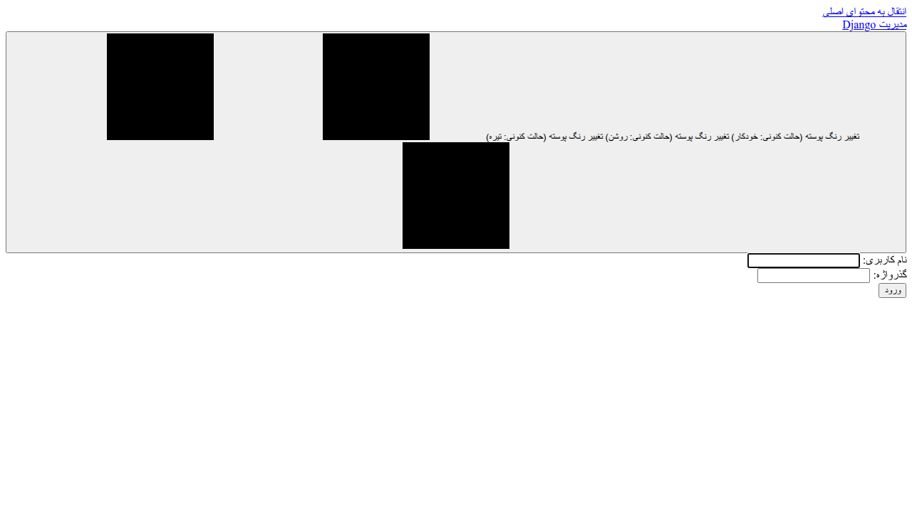 | 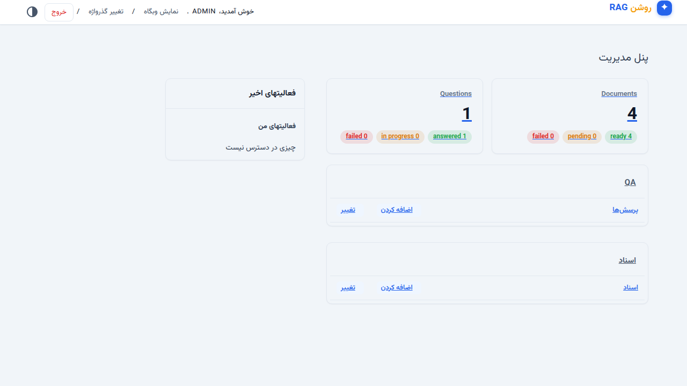 |
| Documents list | Document detail |
| 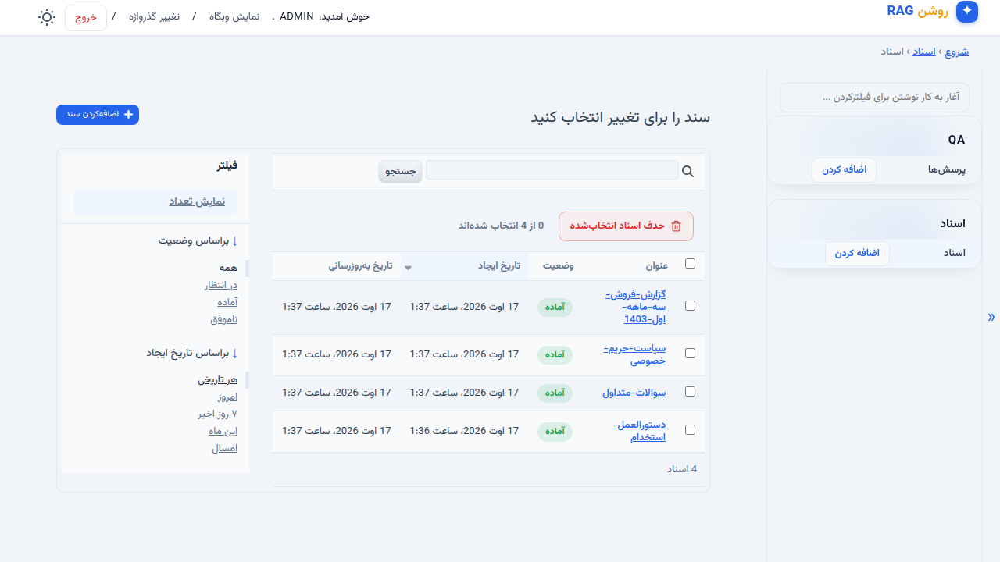 | 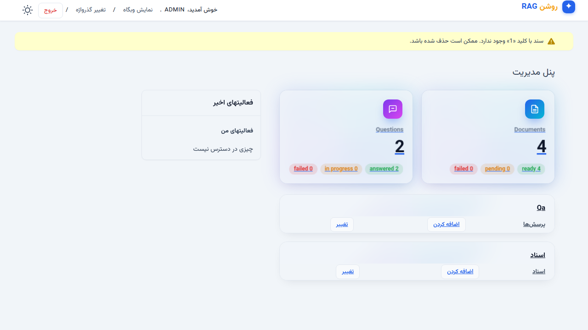 |
| Questions list | Question answer with sources |
| 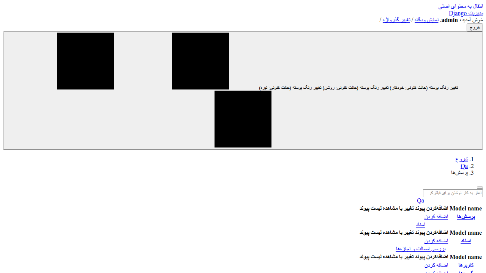 | 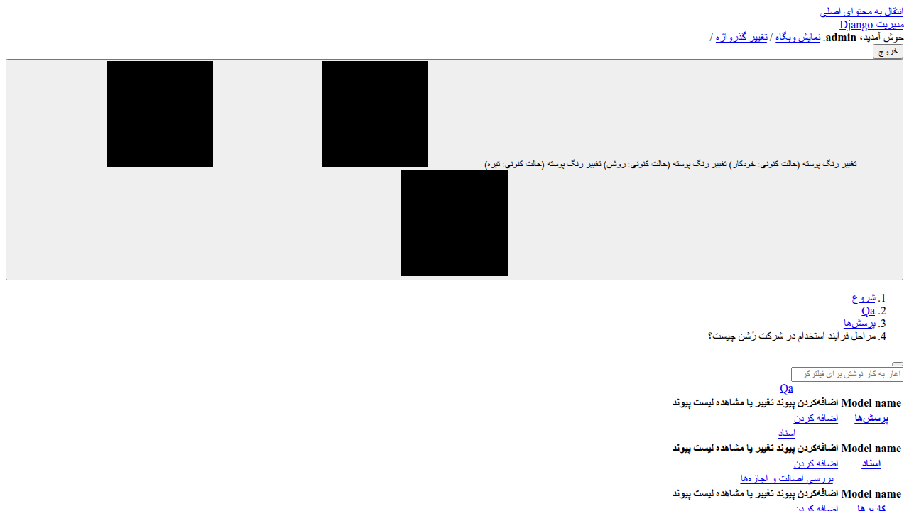 |
| Swagger UI | |
| 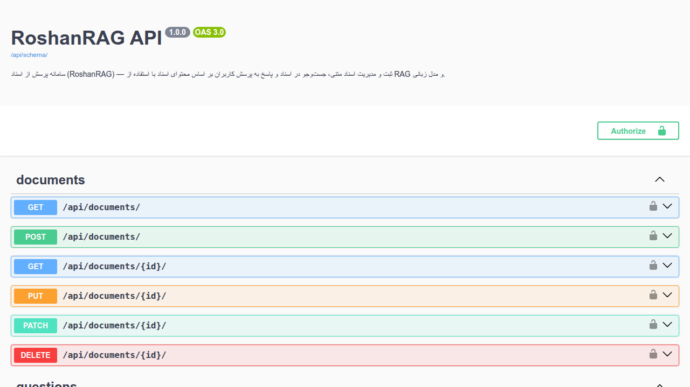 | |
| Dark mode | Mobile |
| 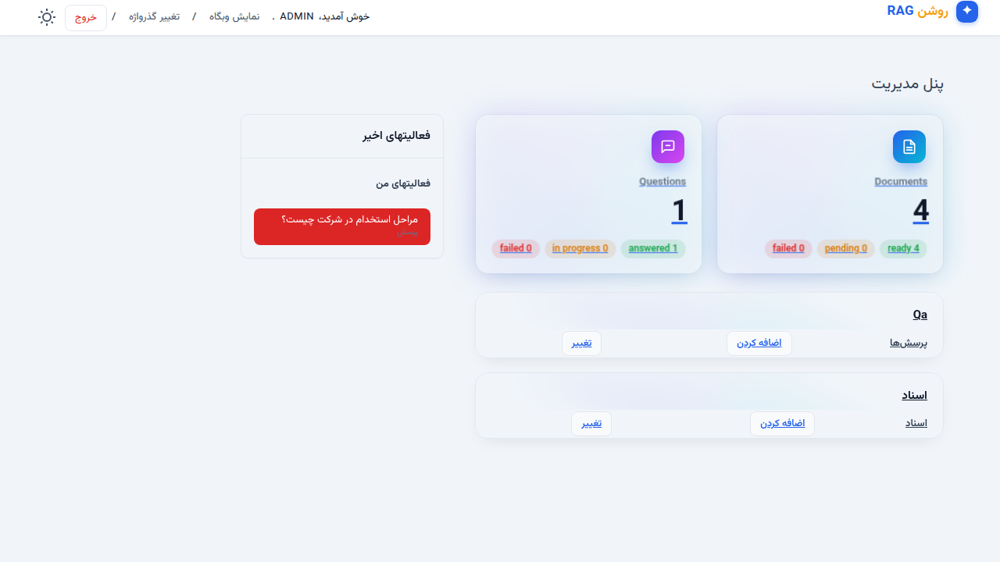 | 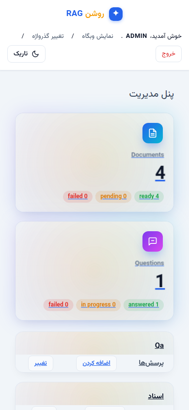 |
| Landing page | Landing dark mode |
| 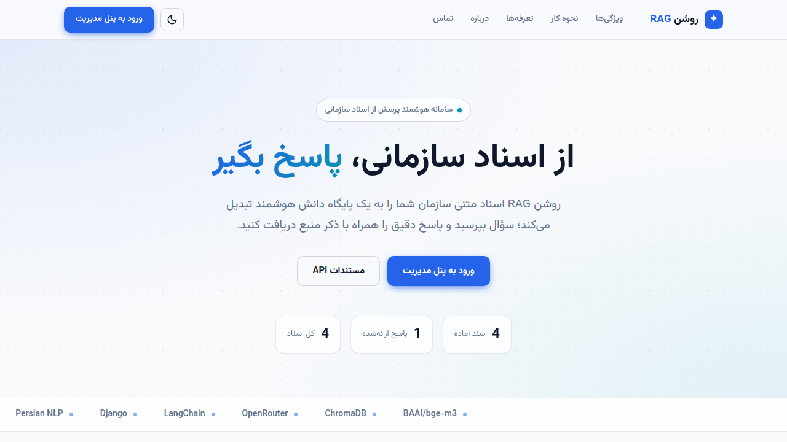 | 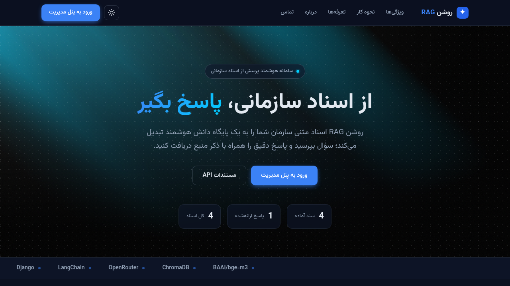 |
| Landing mobile | Styled 404 |
| 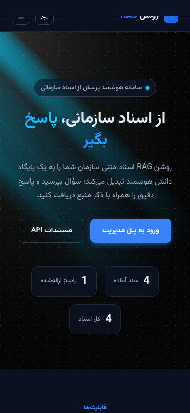 | 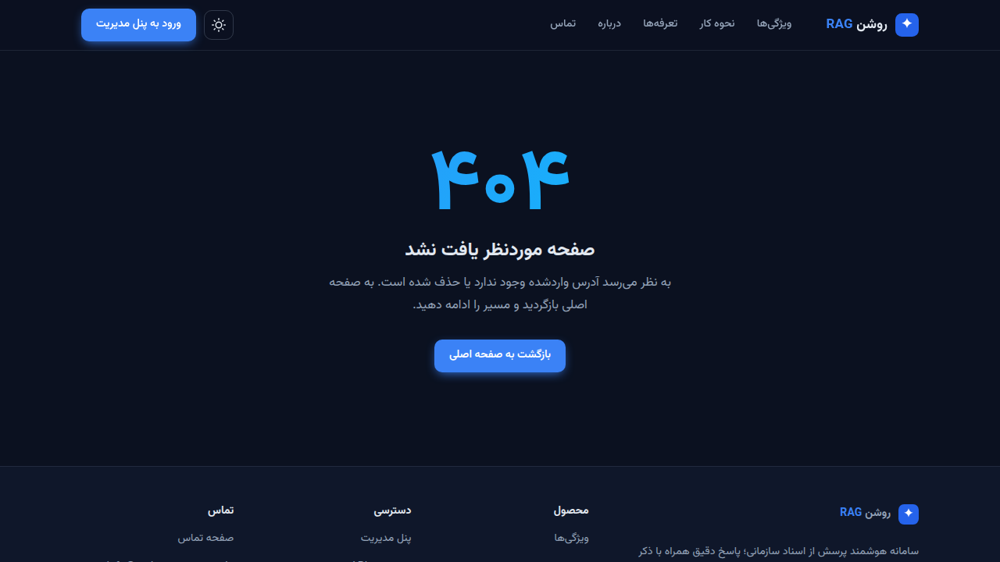 |
| Admin login (light) | Admin login (dark) |
| 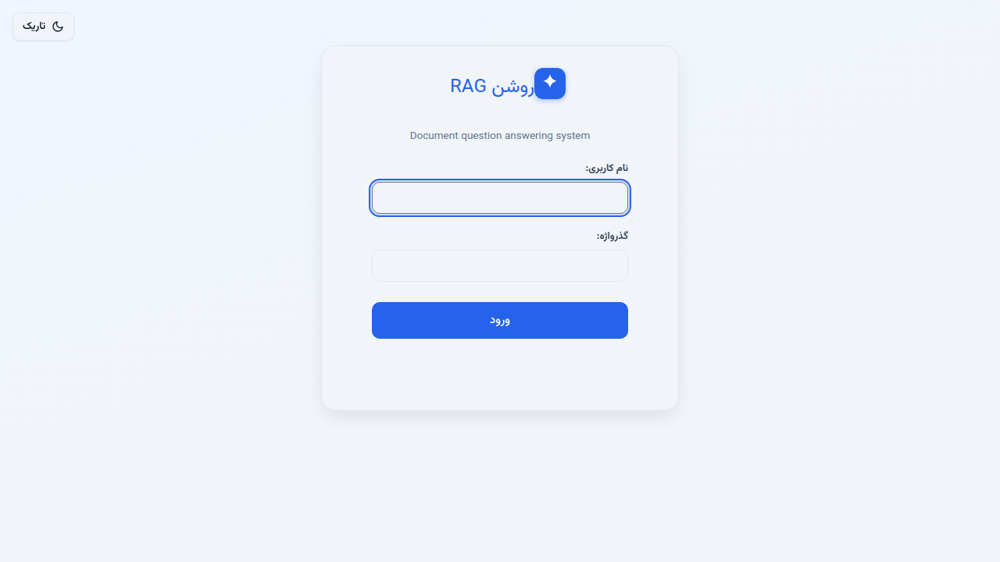 | 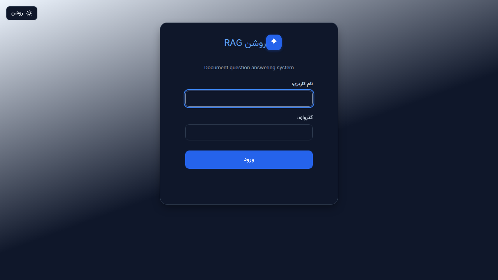 |
| Admin dashboard (light) | Admin dashboard (dark) |
| 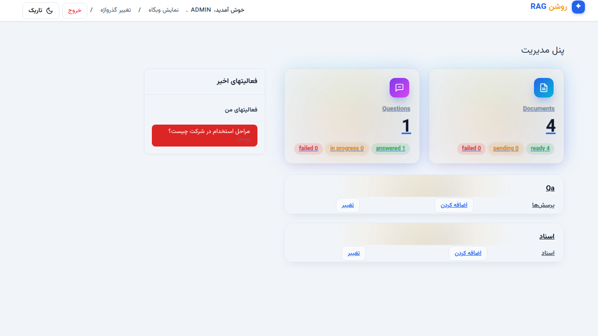 |  |
| Documents list | Document detail |
| 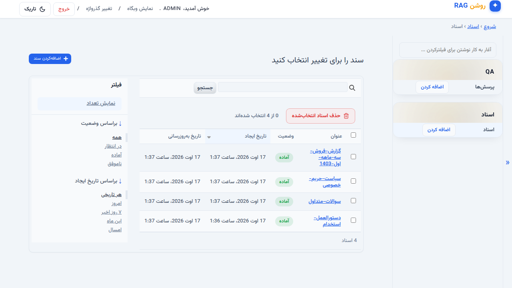 | 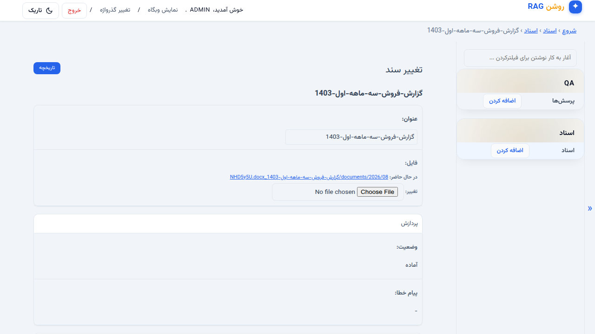 |

## Project Structure

```
config/            Django settings and URLs
core/              Shared services (embeddings, chroma_client, llm_client, workers)
documents/         Document model, services (extraction/chunking/indexing), signals, API
qa/                Question model, RAG answering service, API
templates/landing/ Public landing pages (home, about, pricing, contact, base)
static/landing/    Landing CSS/JS (dark-light theme, mobile nav, count-up, scroll reveals, tilt, magnetic CTAs, marquee)
sample_data/       Four Persian sample documents (3 DOCX + 1 TXT)
Dockerfile         python:3.12-slim; CPU torch by default, CUDA torch via GPU build arg
compose.yaml       web + chroma services
compose.gpu.yaml   GPU override (adds CUDA torch + nvidia device reservation)
entrypoint.sh      Migrate, recover stuck tasks, create superuser, run gunicorn
.env.example       Configuration template
```

## Technical Decisions

- **Embedding model — `BAAI/bge-m3` (MIT).** Strong on Persian (~61% FaMTEB), multilingual (one model for Farsi + English in a single vector space), and permissively licensed. jina-embeddings-v3 was dropped because its license is non-commercial CC BY-NC.
- **GPU-aware, CPU-portable.** The app auto-detects CUDA. `compose.yaml` is CPU-only; `compose.gpu.yaml` builds the image with CUDA torch and requests the GPU. Note: bge-m3 ships `.bin` weights only, so torch ≥ 2.6 is required (modern transformers refuses `torch.load` below it).
- **Background work via Python threads + status fields** (`pending/ready/failed`), per the project's simplicity-first requirement — no Celery/Redis. Stuck tasks are recovered automatically on container start (`recover_stuck_tasks`).
- **Free OpenRouter models with `with_fallbacks`.** Free models get rate-limited, so on error LangChain tries the next model in the chain. Stored errors are unwrapped to the provider's actual message.
- **MMR retrieval.** Retrieval uses maximal marginal relevance (`fetch_k=20`, `k=4`) to balance relevance with diversity, then dedupes to at most 3 documents.
- **Answers are cited.** Every answer returns the source documents used, keeping RAG transparent; answers follow the language of the question.
- **Empty-corpus guard.** Asking a question before any document is indexed skips the LLM call entirely and answers with a deterministic "no documents yet" message, then the admin retry action can re-ask it later.
- **Uploaded media is protected.** `/media/` files require an authenticated session or an `Authorization: Token` header, so uploaded documents are not downloadable by URL guessing; the API still exposes working file links for token clients.
- **Fail-fast secret key.** With `DEBUG=false`, the app refuses to start unless `SECRET_KEY` is a strong random value, instead of silently running on a placeholder key.
- **Separate ChromaDB container** keeps the vector store isolated from the app (pinned to `chromadb/chroma:1.5.9` with a healthcheck).
- **SQLite** for simplicity and persistence via a Docker volume; chunking at 800/200 via `RecursiveCharacterTextSplitter`.
- **Hugging Face xet backend disabled** — it can hang on some networks; downloads fall back to plain HTTP.
- **Custom Persian admin theme** — Django Admin is restyled with a Persian-first design system (bundled Vazirmatn font, RTL, light/dark mode, dashboard stat cards, status pills) via a custom `AdminSite` and template overrides, no third-party admin package. Dashboard and app cards are 3D-interactive (mouse-tracked perspective tilt, glassmorphism, layered depth, count-up stats, cursor-tracking spotlight) with `prefers-reduced-motion` respected, and bulk actions render as explicit buttons instead of a dropdown. Movement is layered across every page: header slide-down, staggered card entrance, IntersectionObserver scroll reveals, a pulsing amber "pending" pill, and press/scale on buttons. Dark mode adds an elegant layered background (radial gradient base, drifting skewed cyan light streaks, dot grid, and fractal-noise texture — ported from the `elegant-dark-pattern` component, with the texture inlined as an SVG data URI). The login page gets its own card entrance and a gently floating logo; the theme toggle there shares its `roshan-theme` storage key with the landing page, so a visitor's preference carries over. Changelists and forms are fully scrollable on phones (no horizontal page overflow).
- **Public landing page** — a bespoke Persian landing (home with hero + bento features + how-it-works + FAQ, plus about, pricing, contact and a styled 404) built in plain Django templates and vanilla CSS, RTL with the bundled Vazirmatn font, dark/light via a shared `data-theme` attribute and `roshan-theme` key. Motion is vanilla JS + CSS only: staggered hero entrance, IntersectionObserver scroll reveals (with a debounced fallback so fast scrolls never skip a reveal), 3D-tilt bento cards with cursor spotlight, magnetic CTA buttons, an infinite tech-stack marquee (bge-m3 · ChromaDB · OpenRouter · LangChain · Django · Persian), smooth FAQ open/close, a rotating/cross-fading theme icon, sliding nav underlines, a hamburger-to-X mobile menu with staggered links, count-up stats, and a drifting streak background — all disabled under `prefers-reduced-motion` and for no-JS visitors. It doubles as the destination for the admin's "View site" link (`AdminSite.site_url = "/"`). Because the home page root is now routed, the admin "View site" link works.
- **Custom 404 page** — served through `handler404` when `DEBUG = false`. In dev (`DEBUG = true`) Django intentionally shows its technical 404 page instead; the styled page is what visitors see in production.
- **WhiteNoise serves static files** — installed in a dedicated Docker layer (keeps the torch layer cached) so gunicorn serves the admin's collected assets.
